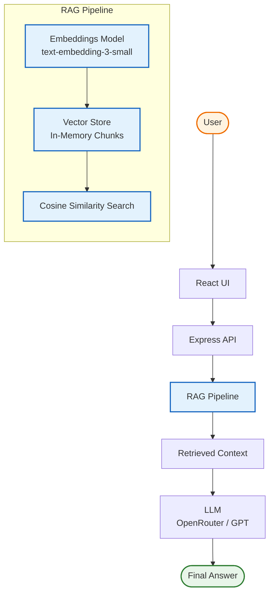

 # 🧠 AI Knowledge Assistant

> A Retrieval-Augmented Generation (RAG) powered AI chatbot that answers questions using a custom knowledge base, semantic search, and LLM reasoning.

🌐 **Live Demo:** https://ai-knowledge-assistant-cydk.onrender.com

---

## 🚀 Overview

AI Knowledge Assistant is a full-stack AI system that combines:

- 🔎 Semantic search (embeddings)
- 📚 Retrieval-Augmented Generation (RAG)
- 🧠 Large Language Models (LLMs)
- ⚡ Vector similarity search

It generates **context-aware, grounded answers** from a custom knowledge base instead of relying on model memory.

---

## ✨ Key Features

### 🧠 RAG-Powered Intelligence
Retrieves relevant context before generating responses.

### 🔎 Semantic Search (Embeddings)
Uses `text-embedding-3-small` to understand meaning beyond keywords.

### ⚡ Vector Similarity Engine
Cosine similarity ranking for best-matching knowledge chunks.

### 💬 Chat Interface
Clean, responsive UI with real-time messaging and loading states.

### 📚 Custom Knowledge Base
FAQ-style dataset for domain-specific grounded answers.

### 🧩 Full-Stack Architecture
- React (Frontend)
- Node.js + Express (Backend)
- OpenRouter / OpenAI API

### 🌍 Production Ready
Deployed and accessible on Render: https://ai-knowledge-assistant-cydk.onrender.com

---

🧱 System Architecture

### 👨‍💻 Author

Shiji Bijo

- GitHub: https://github.com/ShijiBijo84

### ⭐ Support

If you like this project:
- ⭐ Star the repo
- 🍴 Fork and extend it
- 🚀 Build your own RAG assistant
